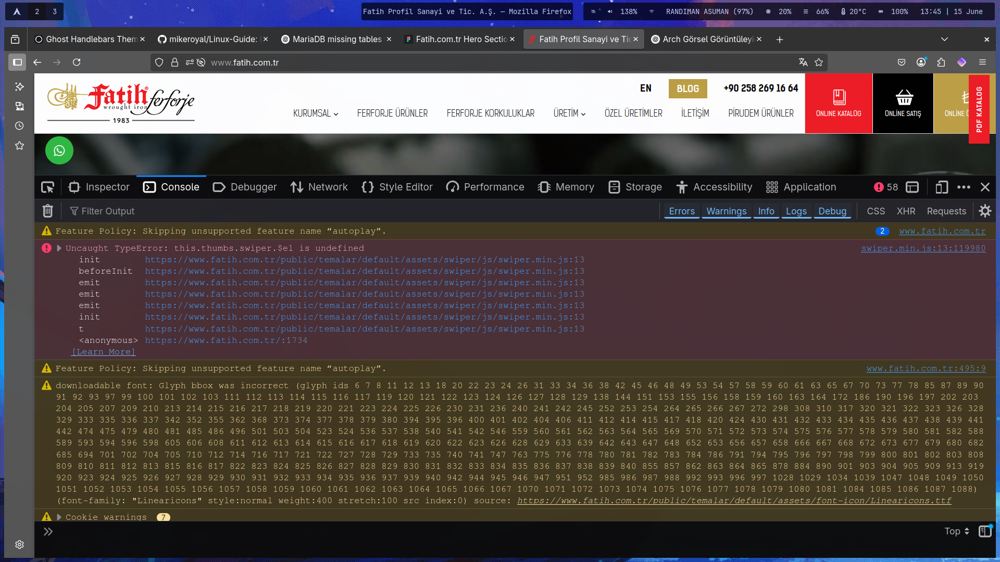
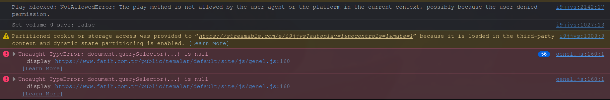

Aşağıda verilen bağlantıların tamamı xlsx dosya olarak repoya ekli. Formattan ötürü okunaklı olmazsa tablolardan inceleyebilirsiniz.
## Missing Return Links
Hreflang ile alternatifi olduğu öne sürülen sayfanın alternatif versiyonunda orijinal içeriğe dönüş için return link olmazsa SEO taramalarında bu problem ortaya çıkıyor.

Örneğin, 

websitesi.com/seo-calismasi

şeklinde bir sayfamız olsun. Bu web sayfasına hreflang ile yeni dil ekledik. Artık elimizde,

websitesi.com/seo-calismasi ve
websitesi.com/en/seo-operation bulunsun.

Artık içeriğimizde iki çeşit hreflang açıklaması var.

```html
<link rel="alternate" hreflang="tr-tr" href="https://www.websitesi.com/seo-calismasi/" />  
  
<link rel="alternate" hreflang="en-us" href="https://www.websitesi.com/en/seo-work/" />
```

Fakat 

```html
https://www.websitesi.com/en/seo-work/"
```

Bağlantısının sahip olduğu hreflang etiketleri arasında 

```html
<link rel="alternate" hreflang="tr-tr" href="https://www.websitesi.com/seo-calismasi/" />  
```

Versiyonu yok. Yani semantik nitelik bakımından Türkçeden İngilizceye çıkışı sağlıyoruz ama dönüş vermiyoruz. Bu missing return links hatasına sebep oluyor. Bu konuyla ilgili ne yapılacağı konusunda fikir yürütülebilir.


***

## Internal Server Hataları
Internal server hataları sorunsuz isteklere gerekli cevabı döndüremeyen sayfalarda oluşur.
Genelde 500 ve 503 döndüren bu sayfalar, 200(OK) verecek duruma getirilmeli. 

https://www.fatih.com.tr/199901
https://www.fatih.com.tr/196761
https://www.fatih.com.tr/20051
https://www.fatih.com.tr/19866
https://www.fatih.com.tr/19868
https://www.fatih.com.tr/19987
https://www.fatih.com.tr/19988

İçerikler yükleniyor fakat belli ki bu probleme sebep olan başka bir durum var.

***
## Non-200 hreflang
200 sonucu döndürmeyen tek bir hreflang etiketli sayfa bulunuyor. Bu sayfanın içerisindeki ulaşılamayan hreflang etiketi kaldırılabilir.

https://www.fatih.com.tr/en/frequently-asked-questions

## Alt bilgisi olmayan imajlar
https://www.fatih.com.tr/public/images/bayraklar/yuvarlak/dil_en.png
https://www.fatih.com.tr/public/images/bayraklar/yuvarlak/dil_tr.png
https://www.fatih.com.tr/public/temalar/default/site/images/icon/search.svg
https://www.fatih.com.tr/public/temalar/default/site/images/icon/sepet.svg
https://www.fatih.com.tr/public/temalar/default/site/images/icon/tl.svg
https://www.fatih.com.tr/public/temalar/default/site/images/katalog1.jpg
https://www.fatih.com.tr/public/temalar/default/site/images/katalog2.jpg
https://www.fatih.com.tr/public/temalar/default/site/images/katalog3.jpg
https://www.fatih.com.tr/public/temalar/default/site/images/katalog4.jpg
https://www.fatih.com.tr/public/temalar/default/site/images/sosyal/1.png
https://www.fatih.com.tr/public/temalar/default/site/images/sosyal/2.png
https://www.fatih.com.tr/public/temalar/default/site/images/sosyal/3.png
https://www.fatih.com.tr/public/temalar/default/site/images/sosyal/4.png
https://www.fatih.com.tr/public/temalar/default/site/images/sosyal/5.png
https://www.fatih.com.tr/public/temalar/default/site/images/sosyal/6.png
https://www.fatih.com.tr/resimler/kategori/11678793095.11666.jpg
https://www.fatih.com.tr/resimler/kategori/aksesuarlar1675412704.42696.jpg
https://www.fatih.com.tr/resimler/kategori/baba-demirler1675168525.40825.jpg
https://www.fatih.com.tr/resimler/kategori/baskili-saclar1675412266.60051.jpg
https://www.fatih.com.tr/resimler/kategori/bogumlu-borular1675412287.93373.jpg
https://www.fatih.com.tr/resimler/kategori/boru-kupesteler1689332657.37047.jpg
https://www.fatih.com.tr/resimler/kategori/cumba-motifli-demirler1675412250.22121.jpg
https://www.fatih.com.tr/resimler/kategori/dekoratif-cubuklar1675412914.25217.jpg
https://www.fatih.com.tr/resimler/kategori/dekoratif-demirler1675412601.05466.jpg
https://www.fatih.com.tr/resimler/kategori/dekoratif-lamalar1675412196.93935.jpg
https://www.fatih.com.tr/resimler/kategori/dekoratif-paneller1675168431.64840.jpg
https://www.fatih.com.tr/resimler/kategori/dekoratif-parcalar1675168549.78758.jpg
https://www.fatih.com.tr/resimler/kategori/dekoratif-profiller1675412812.21288.jpg
https://www.fatih.com.tr/resimler/kategori/dokum-parcalar1689332793.91992.jpg
https://www.fatih.com.tr/resimler/kategori/dovme-basliklar1689332957.28187.jpg
https://www.fatih.com.tr/resimler/kategori/dovme-bilezik-rozetler1689332773.81309.jpg
https://www.fatih.com.tr/resimler/kategori/dovme-mizraklar1689332756.95006.jpg
https://www.fatih.com.tr/resimler/kategori/dovme-motifli-demirler1689332834.34425.jpg
https://www.fatih.com.tr/resimler/kategori/dovme-motifli-parcalar1689332685.94981.jpg
https://www.fatih.com.tr/resimler/kategori/kelepceler1675412107.04486.jpg
https://www.fatih.com.tr/resimler/kategori/kozalaklar1675412553.86440.jpg
https://www.fatih.com.tr/resimler/kategori/kozalakli-demirler1675412575.25932.jpg
https://www.fatih.com.tr/resimler/kategori/kupesteler1689332702.20012.jpg
https://www.fatih.com.tr/resimler/kategori/lama-motifli-demirler1689682407.56296.jpg
https://www.fatih.com.tr/resimler/kategori/merdiven-baslangiclari1675412682.69747.jpg
https://www.fatih.com.tr/resimler/kategori/montaj-aksesuar1675412216.87348.jpg
https://www.fatih.com.tr/resimler/kategori/nervurlu-demirler1689332816.00734.jpg
https://www.fatih.com.tr/resimler/kategori/patina-boyalar1675412726.86225.jpg
https://www.fatih.com.tr/resimler/kategori/sac-bordurler1689332636.06156.jpg
https://www.fatih.com.tr/resimler/kategori/sac-parcalar1679551142.48110.jpg
https://www.fatih.com.tr/resimler/kategori/yapraklar1675412232.33484.jpg
https://www.fatih.com.tr/resimler/loadinglogo.jpg
https://www.fatih.com.tr/resimler/projekategori/1350-kodlu-ferforje-kapi-9365-jpg1698756892.39618.jpg
https://www.fatih.com.tr/resimler/projekategori/2032-jpg1698756533.90245.jpg
https://www.fatih.com.tr/resimler/projekategori/2303-jpg1698756555.00741.jpg
https://www.fatih.com.tr/resimler/projekategori/2455-jpg1698660046.87018.jpg
https://www.fatih.com.tr/resimler/projekategori/2456-r-jpg1698224799.57721.jpg
https://www.fatih.com.tr/resimler/projekategori/ferforje-kapilar-jpg1689335428.35919.jpg
https://www.fatih.com.tr/resimler/projekategori/ferforje-merdivenler-jpg1689335447.44771.jpg
https://www.fatih.com.tr/resimler/projekategori/ferforje-pencereler-jpg1689335456.12555.jpg
***

## Genel tasarım ve performans problemleri
Mevcut web uygulamasının ana sayfasında bulunan videonun SRC uzantısı streamable.com isimli bir platforma çıkıyor. Video web sitelerinin erişime kapatıldığı kurumsal internetlerde ya da filtrelemelerde bu web sitesi takıldığı için bizim web sitemizin ana sayfasındaki video da yüklenmiyor ve iframe crash hatası döndürüyor. 

Haşem Bey, bu videoya compress uygulayıp bir CDN ile dağıtmanız mümkün mü? Tasarımı değiştirmeden videonun daha hızlı yüklenmesini istiyoruz. 

Masaüstündeki Müşteri Yorumları, Tarihçe ve Üretim isimli kısımların içi boş. Bu kısımların içerisinin doldurulmasını sağlarsak güzel olur. Ben ihtiyaç duyacağınız görselleri belirtmeniz durumunda size ileteceğim.

Pirudem Ürünler  
Bu bağlantı artık kullanılmayan pirudem.com alan adına yönlendirme yapıyor. Bu kısmın fatih.com.tr/pirudem adresine yönlendirme yapması gerek.

Sayfanın responsive tasarımı için mi böyle bir uygulamada bulunuyorsunuz bilmiyorum fakat resize için koyduğunuz event listener doğru çalışmıyor ve sayfayı yeniden boyutlandırmaya çalıştığımızda ekteki görsellerde görebileceğiniz gibi saniyeler içerisinde konsola onlarca hata basılıyor.  

Aynı şekilde swiper.js isimli bir JS dosyasındaki hata dolayısıyla yine konsola bir hata basıldığını görebiliyorum. Oradaki syntax hatasını ya da boş class okumaya çalışan kod parçasını iptal ederseniz konsoldaki hatadan kurtulmuş oluruz. Bu JS dosyaları da yine minify edilmemiş ve doğrudan incelenebilir şekilde bırakılmış. Bunları minify ederseniz daha güzel olur.



Görüldüğü üzere konsolda pek çok farklı kaynaktan basılan bir çok hata var. Bunlardan bir tanesi resize eylemini dinliyor ve bu fonksiyon pencere yeniden şekillndikçe yeni hata basıyor.



Haşem Bey, ayrıca www.pirudem.com ve www.fatihferforje.com adreslerinin sizin web panelinizden park edilmesi gerekiyor. Biz A kaydı yapıyoruz lakin zannediyorum ki dışarıdan yönlendirme almaya kapalı bir sunucu kullanıyorsunuz, bu domainleri hosting servisinize park ederseniz memnun oluruz.

Saygılar
Hakan Altay Ağyar
